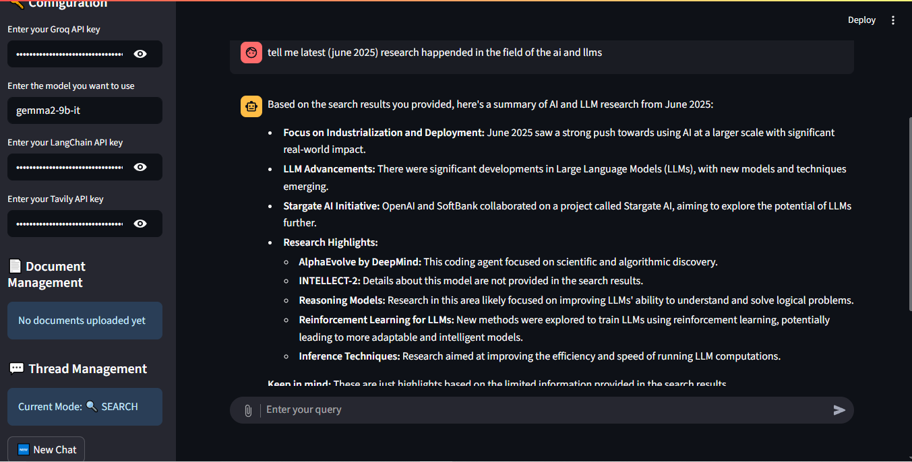
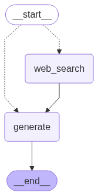
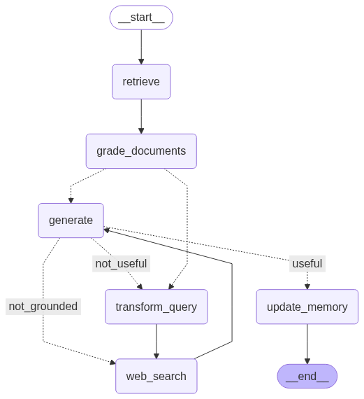

# 🤖 Kaito-AI - Intelligent Search & Document Analysis

A powerful AI-powered chatbot built with Streamlit that combines web search capabilities with document analysis using Retrieval-Augmented Generation (RAG). This application provides intelligent responses by either searching the web for current information or analyzing uploaded documents.
[](https://kaito-ai.streamlit.app)



## ✨ Features

### 🔍 **Intelligent Web Search Mode**
- **Smart Routing**: Automatically determines when to search the web vs. use internal knowledge
- **Real-time Information**: Access to current events, news, and up-to-date information
- **Tavily Integration**: Powered by Tavily search API for accurate web results
- **Context-Aware**: Maintains conversation context across multiple queries



### 📄 **Document Analysis (RAG Mode)**
- **PDF Upload**: Support for multiple PDF document uploads
- **Intelligent Chunking**: Advanced text splitting for optimal retrieval
- **Vector Search**: Uses HuggingFace embeddings for semantic document search
- **Document Memory**: Persistent storage of uploaded documents
- **Contextual Answers**: Provides answers based on your specific documents



### 💬 **Advanced Chat Management**
- **Multi-Threading**: Separate conversation threads for different topics
- **Mode Switching**: Seamless switching between search and RAG modes
- **Conversation History**: Persistent chat history with SQLite storage
- **Thread Management**: Create, delete, and organize multiple conversations
- **Smart Previews**: Quick preview of conversation topics

### 🔧 **Technical Features**
- **LangGraph Integration**: Advanced workflow management with state graphs
- **Memory Persistence**: SQLite-based conversation memory
- **Model Flexibility**: Support for multiple Groq models (Gemma, Llama, etc.)
- **LangSmith Tracing**: Built-in observability and debugging
- **Error Handling**: Robust error handling and user feedback
- **Document Cleanup**: Automatic cleanup of temporary files and vector stores

## 🚀 Quick Start

### Prerequisites
- Python 3.8 or higher
- Groq API key
- Tavily API key
- LangChain API key (optional, for tracing)

### 📥 Clone the Repository

```bash
git clone https://github.com/yourusername/clone-chatgpt.git
cd clone-chatgpt
```

### 📦 Install Dependencies

```bash
pip install -r requirements.txt
```

### 🔑 API Keys Setup

You'll need to obtain the following API keys:

1. **Groq API Key**:
   - Visit [Groq Console](https://console.groq.com/)
   - Sign up and get your API key

2. **Tavily API Key**:
   - Visit [Tavily](https://tavily.com/)
   - Sign up and get your API key

3. **LangChain API Key** (Optional):
   - Visit [LangSmith](https://smith.langchain.com/)
   - Sign up for tracing and monitoring

### 🏃‍♂️ Run the Application

```bash
streamlit run app.py
```

The application will open in your browser at `http://localhost:8501`

## 📖 How to Use

### 1. **Initial Setup**
- Enter your API keys in the sidebar
- Choose your preferred model (default: gemma2-9b-it)
- The app will validate your keys and initialize

### 2. **Search Mode** 🔍
- Start typing your questions in the chat input
- The AI will automatically determine if web search is needed
- Get real-time information about current events, news, and more
- Perfect for: Current events, latest news, real-time data

### 3. **Document Analysis Mode** 📄
- Upload PDF documents using the file upload feature
- The app automatically switches to RAG mode
- Ask questions about your uploaded documents
- Get precise answers based on document content
- Perfect for: Research papers, reports, manuals, books

### 4. **Thread Management** 💬
- Create new conversations with the "New Chat" button
- Switch between different conversation threads
- Delete unwanted threads
- Clean up empty threads automatically

## 🏗️ Project Structure

```
clone-chatgpt/
├── app.py                 # Main Streamlit application
├── requirements.txt       # Python dependencies
├── assets/               # Screenshots and images
│   ├── app.PNG
│   ├── rag.png
│   └── search.png
├── agent/                # Search agent implementation
│   ├── __init__.py
│   └── search.py         # Web search logic with LangGraph
├── rag/                  # RAG implementation
│   ├── __init__.py
│   └── agentic_rag.py    # Document analysis with vector search
├── database/             # Database management
│   ├── __init__.py
│   ├── get_sql.py        # SQLite memory management
│   ├── rag_chatbot.db    # RAG conversations database
│   └── search_chatbot.db # Search conversations database
└── utility.py            # Helper functions and utilities
```

## 🔧 Configuration

### Supported Models
- `gemma2-9b-it` (default)
- `llama-3.1-70b-versatile`
- `llama-3.1-8b-instant`
- `mixtral-8x7b-32768`
- And other Groq-supported models

### Environment Variables
The app supports the following environment variables:
- `GROQ_API_KEY`: Your Groq API key
- `TAVILY_API_KEY`: Your Tavily search API key
- `LANGCHAIN_API_KEY`: Your LangChain API key (optional)

## 🛠️ Advanced Features

### Custom Document Processing
- **Chunk Size**: 1000 characters with 200 character overlap
- **Embeddings**: Uses `sentence-transformers/all-mpnet-base-v2`
- **Vector Store**: ChromaDB for efficient similarity search
- **File Support**: PDF documents with automatic text extraction

### Memory Management
- **Persistent Storage**: SQLite databases for conversation history
- **Thread Isolation**: Separate memory for search and RAG modes
- **Automatic Cleanup**: Removes empty conversations and temporary files

### Error Handling
- **API Validation**: Validates API keys before initialization
- **Graceful Degradation**: Handles missing documents or failed searches
- **User Feedback**: Clear error messages and success notifications

## 🤝 Contributing

1. Fork the repository
2. Create a feature branch (`git checkout -b feature/amazing-feature`)
3. Commit your changes (`git commit -m 'Add amazing feature'`)
4. Push to the branch (`git push origin feature/amazing-feature`)
5. Open a Pull Request

## 📝 License

This project is licensed under the MIT License - see the [LICENSE](LICENSE) file for details.

## 🙏 Acknowledgments

- **LangChain**: For the powerful LLM framework
- **LangGraph**: For advanced workflow management
- **Streamlit**: For the beautiful web interface
- **Groq**: For fast LLM inference
- **Tavily**: For intelligent web search
- **ChromaDB**: For vector storage and retrieval
- **HuggingFace**: For embeddings and models

---

**Made with ❤️ using Python, Streamlit, and LangChain**
