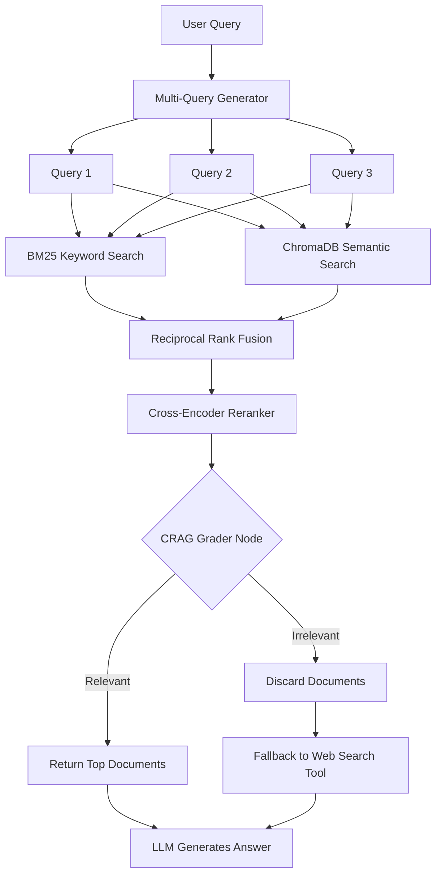

# Kaito-AI

Kaito-AI is a state-of-the-art conversational AI backend featuring **Corrective RAG (CRAG)**, **Multi-Query HyDE Transformations**, and **Hybrid Search** with cross-encoder reranking. It's built on a secure, multi-user architecture with full state persistence, agent tracking, and server-sent events (SSE) streaming.

## 🌟 Key Features

- **Advanced RAG Pipeline:**
  - **Multi-Query Generation:** Automatically rewrites user queries into 3 unique variations to dramatically improve document retrieval recall.
  - **Hybrid Retrieval:** Blends keyword (BM25) and semantic (ChromaDB) search using Reciprocal Rank Fusion (RRF).
  - **Cross-Encoder Reranking:** Reranks all retrieved chunks for maximum precision.
  - **Corrective RAG (CRAG):** Passes the top chunks through an LLM Grader. If the documents are deemed irrelevant, the agent automatically falls back to **Tavily Web Search**.
- **Unified LangGraph Agent:** Dynamically arms the agent with a `document_retriever` (if PDFs are uploaded) and a `web_search` fallback tool.
- **Secure Multi-User Auth:** Built-in SQLite authentication (hashed with `pbkdf2_hmac`), session cookies, and strict data isolation across vectors, threads, and uploads.
- **Real-time SSE Streaming:** Streams LLM responses token-by-token directly to the frontend.
- **Thread Branching (Edit & Regenerate):** Allows users to edit past messages and fork the conversation history safely, mimicking ChatGPT's behavior.
- **Token Tracking & Rate Limits:** Built-in rate limiting that caps daily API usage per user to prevent abuse.
- **LangSmith Tracing:** Full integration for observing agent actions, token usage, and latency.

## 🏗️ Architecture

The backend uses LangGraph to orchestrate a ReAct agent. Here is how the Advanced RAG retrieval tool works:


```mermaid
flowchart TD
    A[User Query] --> B[Multi-Query Generator]
    B --> C[Query 1]
    B --> D[Query 2]
    B --> E[Query 3]
    
    C & D & E --> F[BM25 Keyword Search]
    C & D & E --> G[ChromaDB Semantic Search]
    
    F & G --> H[Reciprocal Rank Fusion]
    H --> I[Cross-Encoder Reranker]
    
    I --> J{CRAG Grader Node}
    J -->|Relevant| K[Return Top Documents]
    J -->|Irrelevant| L[Discard Documents]
    
    K --> M[LLM Generates Answer]
    L --> N[Fallback to Web Search Tool]
    N --> M
```

## 🚀 Setup & Installation

### 1. Prerequisites
- Python 3.11 - 3.13
- [`uv`](https://github.com/astral-sh/uv) (Extremely fast Python package manager)

### 2. Install Dependencies
```bash
uv sync
```

### 3. Environment Variables
Create a `.env` file in the root directory based on `.env.example`:

```env
GROQ_API_KEY=gsk_...
TAVILY_API_KEY=tvly-...
LANGCHAIN_API_KEY=lsv2_...
```

### 4. Run the Application
The app runs on FastAPI and Uvicorn.
```bash
uv run uvicorn api:app --reload --port 8000
```
Open `http://localhost:8000` in your browser.

## 🧪 Testing

Kaito-AI comes with a full `pytest` suite for validating authentication, API routes, and agent vector isolation.

```bash
uv run pytest tests/
```

## 🛠️ Technology Stack
- **Framework:** FastAPI
- **Agent Orchestration:** LangGraph & LangChain
- **LLM Provider:** Groq (`openai/gpt-oss-20b` or Gemini equivalents via ChatGroq)
- **Vector DB:** ChromaDB
- **Embeddings:** HuggingFace (`all-mpnet-base-v2`)
- **Reranker:** Sentence-Transformers Cross-Encoder (`ms-marco-MiniLM-L-6-v2`)
- **Web Search:** Tavily
- **Database:** SQLite (Sync + AsyncSqliteSaver)
